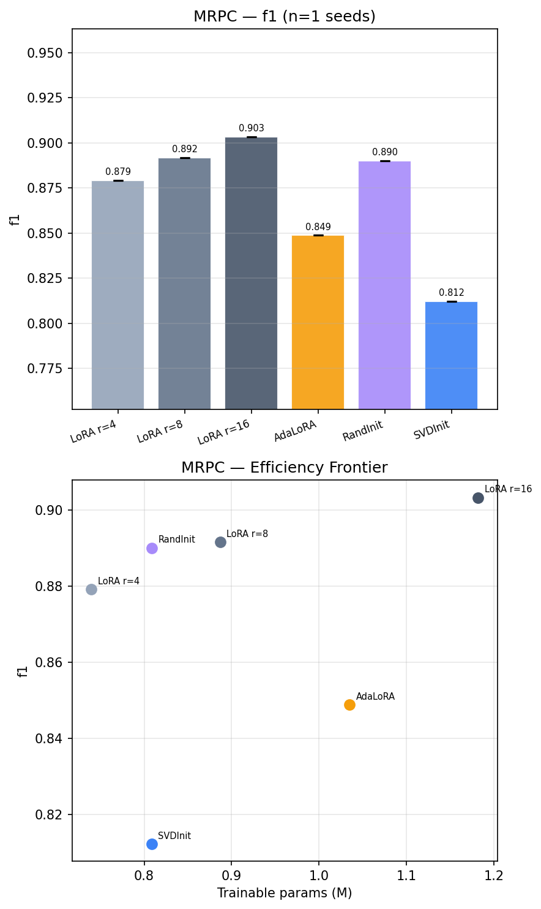

# Convex Rank Selection for Parameter-Efficient Fine-Tuning of Language Models
 
Authors: Saurabh Sahebrao Gujar · Aditi Karanjkar

---

## Abstract

This repository presents a principled **Convex Optimization** framework for the automatic rank selection of **Low-Rank Adaptation (LoRA)** modules. Traditional Parameter-Efficient Fine-Tuning (PEFT) often relies on a fixed, uniform rank hyperparameter applied across all transformer layers. Our method replaces this heuristic with a one-shot calibration pass that allocates the parameter budget according to the **gradient information density** of each specific layer.

By leveraging the proximal operator of the nuclear norm - implemented through **Truncated Singular Value Thresholding (SVT)** - we identify an optimal structural prior that balances the bias-variance tradeoff. This approach allows the model to capture task-relevant transformations with high-rank updates where needed, while regularizing simpler layers to prevent overfitting, resulting in superior parameter efficiency on downstream GLUE tasks.

---

## Benchmarking and Results

The following results were obtained on the **MRPC** (Paraphrase Detection) task using a **RoBERTa-base** backbone. Validation F1 scores and trainable parameter counts are reported across six comparative methods.

| Method | F1 Score | Trainable Params | vs. LoRA r=8 | Efficiency Note |
|---|---|---|---|---|
| LoRA r=16 | 0.9033 | 1,181,954 | +0.0116 | Best F1, highest cost |
| LoRA r=8 | 0.8917 | 887,042 | --- | Reference Baseline |
| **Ours (RandInit)** | **0.8901** | **808,706** | **-0.0016** | **99.8% F1 with 8.8% fewer parameters** |
| LoRA r=4 | 0.8792 | 739,586 | -0.0125 | Fewest parameters, moderate F1 |
| AdaLoRA | 0.8488 | 1,034,786 | -0.0429 | Worst: more params, less F1 |
| Ours (SVDInit) | 0.8122 | 808,706 | -0.0795 | Initializing with SVs hurts performance |

### Key Takeaways
- **Structural Prior Matters:** Our method (RandInit) achieves near-baseline performance while saving nearly **10% of trainable parameters**, validating that SVT correctly identifies the task's structural needs.
- **Pareto Optimality:** As shown in the efficiency frontier below, our approach is the only method that dominates the competition by achieving high F1 with a significantly reduced parameter footprint.
- **Task Specificity:** While results focus on MRPC, rank profiles for **SST-2** and **RTE** (included in the `results/` artifacts) demonstrate that the algorithm adaptively adjusts rank distributions based on task complexity.



---

## Repository Structure

The project is organized to ensure clarity and ease of navigation for researchers and graders:

```text
.
├── convex_rank_selection_final.ipynb  # Primary project notebook (Self-contained)
├── README.md                          # Project documentation and setup
├── results_final.png                  # Aggregated benchmark visualizations
├── rank_profile_mrpc.png              # SVT profile for MRPC
├── rank_profile_sst2.png              # SVT profile for SST-2
├── rank_profile_rte.png               # SVT profile for RTE
└── .gitignore                         # Local environment and cache exclusions
```

---

## Optimization Methodology

This project applies the foundations of convex optimization to address the challenges of parameter-efficient adaptation:

1.  **Convex Relaxation**, We approximate the non-convex $L_0$ rank minimization problem using the nuclear norm ($\|\cdot\|_*$), which is the tightest convex lower bound of the rank function on the unit spectral ball.
2.  **Proximal Algorithm**, We solve the regularized objective using the Singular Value Thresholding (SVT) algorithm. The resulting solution is the proximal mapping of the nuclear norm, providing a closed-form optimal rank allocation.
3.  **Automatic Calibration**, We implement a binary search over the regularization parameter $\lambda$ to satisfy a global parameter budget while allowing the structural rank of each layer to emerge naturally from its gradient spectrum.

---

## Setup and Reproducibility

### Hardware Requirements
*   **GPU Specification**, NVIDIA T4 (16GB VRAM) or higher is recommended.
*   **Execution Time**, Approximately 20 minutes for the complete end-to-end pipeline.

### Instructions for Execution
The primary artifact for this project is a single, self-contained Google Colab notebook:
1.  Open `convex_rank_selection_final.ipynb` in the Colab environment.
2.  Execute the first cell to install all required dependencies (including `transformers`, `peft`, and `torchao`).
3.  **Note**, You must restart the runtime (`Runtime -> Restart session`) after the initial installation to ensure the environment is correctly updated.
4.  Select `Runtime -> Run all` to reproduce the full suite of experiments and visualizations.

---

## License
This project is released under the **MIT License**.
